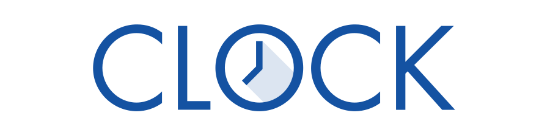

# Über das Projekt

## Arbeitszeitdokumentation einfach EINFACH

Das Projekt ClockGU verfolgt die Bereitstellung einer Softwarelösung \(**Clock**\), die Hilfskräften an der Goethe-Universität die Führung des Arbeitszeitkontos \(AZK\) nach den Maßgaben der aktuellen gesetzlichen Regelungen im Rahmen des Gesetz zur Regelung eines allgemeinen Mindestlohns \(MiLoG\) erleichtern soll.

Diese Seiten dienen vorerst als Handbuch. Später werden die Inhalte auch innerhalb der Anwendung als Direkthilfe zur Verfügung stehen.


Clock "spricht" aktuell englisch und deutsch - nur ein englisches Handbuch haben wir derzeit noch nicht. Wenn Du mithelfen möchtest, Clock in andere Sprachen zu übersetzen, kannst Du Dich gerne bei uns melden: [**clock-kontakt@dlist.uni-frankfurt.de**](mailto:clock-kontakt@dlist.uni-frankfurt.de)


