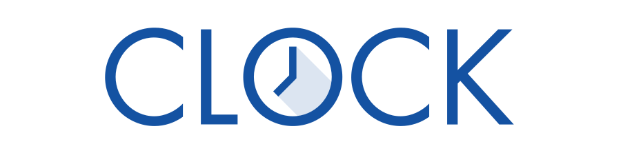

# About the Project

## Working time documentation simply SIMPLE

The project ClockGU provides a software solution (**Clock**), to facilitate the management of the Work Time Account (WTA, German: Arbeitszeitkonto, AZK) for student assistants in accordance with the German Minimum Wage Law (MiLoG).

In other words: Clock is a comfortable tool to track your working hours and hand in the monthly due time sheets digitally.

These pages are the official Clock handbook which will be integrated into the app in the future.


Due to continuous development, some articles in this handbook are in need of a refinement.


You can sign on to Clock with your HRZ account at [clock.uni-frankfurt.de](http://clock.uni-frankfurt.de)
